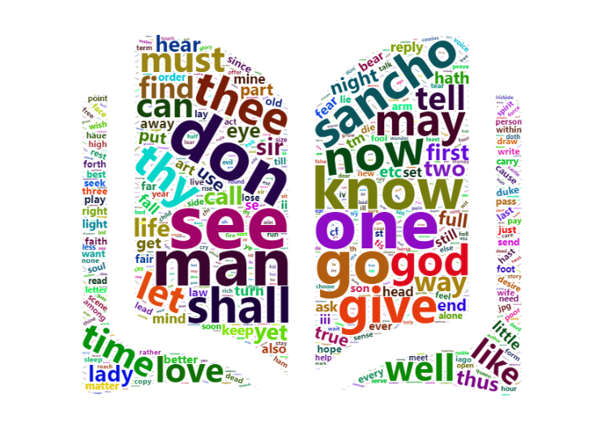

```{r setup, include=FALSE}
knitr::opts_chunk$set(echo = FALSE)

library(dplyr)
library(ggplot2)
library(ggrepel)
library(reshape2)
library(scales)
library(tm)
library(wordcloud2)
library(plotly)
library(maps)
Sys.setenv('MAPBOX_TOKEN' = 'pk.eyJ1IjoiY2ltY2lyaW1jaSIsImEiOiJjazU5ejkwZmQxMjdjM2VxeGdqOGVnMnRkIn0.ZcC-1pGUFVd80U1G0G2yoQ')

clean_dataset <- function(dataset){
  dataset <-  filter(dataset, !Lemma %in% stopwords(kind="en"))
  dataset <-  filter(dataset, nchar(Lemma) > 1)
  return(dataset)
}

#setwd("C:/Users/grzeg/Desktop/studia/Data Science/2 rok/semestr 1/Advanced_VisualisationR/projekt/Adv_Vis_R_Project")
'17th_data' <- data.frame(readxl::read_xlsx("17th_joined_file.xlsx")) %>% clean_dataset()
'18th_data' <- data.frame(readxl::read_xlsx("18th_joined_file.xlsx")) %>% clean_dataset()
'19th_data' <- data.frame(readxl::read_xlsx("19th_joined_file.xlsx")) %>% clean_dataset()
'20th_data' <- data.frame(readxl::read_xlsx("20th_joined_file.xlsx")) %>% clean_dataset()
authors_data <- data.frame(readxl::read_xlsx("Author_birthplace_with_geo_data.xlsx"))

basic_words <- readLines("basic_words.txt", warn = FALSE) %>% 
  strsplit(",") %>% unlist() %>% 
  strsplit(" ") %>% unlist() %>% 
  strsplit("/") %>% unlist()
basic_words <- basic_words[nchar(basic_words)>1 & !basic_words %in% stopwords(kind="en")]

```

## Goals of the project

> - See the evolution of English language in literature between 17th - 20th century
> - Cross Century Analysis of Sentiment
> - Cross Century Analysis of Parts of Speech

## Dataset Description

> - Books collected from Gutenberg Project
> - Sample of books for centuries based on rank of most popular ones from www.goodreads.com

## Dataset Preparation

> - Only words extracted from books with regex
> - Lemmatization introduced with Stanford NLP Library - Python
> - Removing stopwords with R package tm
> - Sentiment Analysis of Lemmatized Words with Vader - Python


# Initial analysis

## Number of Authors vs Number of Titles

```{r echo = FALSE}
centuries <- c("17th", "18th", "19th", "20th")
number_of_titles <- c(15, 15, 15, 14)

century_basic <- data.frame(centuries, number_of_titles)
century_basic <- cbind(century_basic, authors_data %>% group_by(Century) %>% tally(name = "Number of Authors") %>% select_at("Number of Authors"))
century_basic_long <- melt(century_basic, id=c("centuries"))

ggplot(century_basic_long) + geom_bar(aes(x = centuries, y = value, fill = variable), stat = "identity", position = "dodge", width = 0.7) + 
  scale_fill_manual("Variable\n", values = c("orange", "blue"), labels = c("Number of Titles", "Number of Authors")) + 
  labs(x = "\nCenturies", y = "\nNumber of") + 
  theme_bw(base_size = 14) 
  
```

## Birthplaces of most popular authors

```{r echo=FALSE, out.width="800px", warning=FALSE}
map_plot <- authors_data %>% 
  plot_mapbox(lon = ~longitude,
              lat = ~latitude,
              split = ~Century,
              size=2,
              mode = 'scattermapbox+markers',
              text=~paste(Author, Birthplace, sep = "\n"),
              hoverinfo='text',
              marker=list(opacity=0.67, size=15)) %>% 
  layout(title = "Birthplace of the most popular authors from 17th to 20th century",
         mapbox = list(),
         legend = list(orientation='h', y=0.12),
         margin = list(l = 25, r = 25,
                       b = 25, t = 25,
                       pad = 2)
         )

map_plot


```

## Total Number of Words vs Count of Unique Words for each Century

```{r echo = FALSE}
num_of_occ <- c(sum(`17th_data`$Number.of.occurences), sum(`18th_data`$Number.of.occurences), sum(`19th_data`$Number.of.occurences), sum(`20th_data`$Number.of.occurences))

num_of_unique <- c(length(unique(`17th_data`$Lemma)), length(unique(`18th_data`$Lemma)), length(unique(`19th_data`$Lemma)), length(unique(`20th_data`$Lemma)))

century_basic <- cbind(century_basic, num_of_occ, num_of_unique)

century_basic_long <- melt(century_basic[,c("centuries", "num_of_occ", "num_of_unique")], id=c("centuries"))

ggplot(century_basic_long) + geom_bar(aes(x = centuries, y = value, fill = variable), stat = "identity", position = "dodge", width = 0.7) + 
  scale_fill_manual("Variable\n", values = c("orange", "blue"), labels = c("Count of All Words", "Count of Unique Words")) + 
  scale_y_continuous(labels = function(x) format(x, scientific = FALSE, big.mark = " ")) +
  labs(x = "\nCenturies", y = "\nNumber of") + 
  theme_bw(base_size = 14)


```

## Count of Unique Words to All Words

```{r echo = FALSE}
century_basic <- century_basic %>% mutate(Unique_to_all = round(num_of_unique/num_of_occ,4))

ggplot(century_basic) + geom_bar(aes(x = centuries, y = Unique_to_all), stat = "identity", width = 0.7, fill ="orange") + 
  scale_y_continuous(labels = function(x) percent(x)) +
  labs(x = "\nCenturies", y = "\nProportion") + 
  theme_bw(base_size = 14)
```


# Part of speech analysis

```{r echo = FALSE}
`17th_data`$Part_of_speech <- ifelse(`17th_data`$Part_of_speech %in% c("VERB", "ADJ", "ADV", "NOUN"), `17th_data`$Part_of_speech, "OTHER")
`18th_data`$Part_of_speech <- ifelse(`18th_data`$Part_of_speech %in% c("VERB", "ADJ", "ADV", "NOUN"), `18th_data`$Part_of_speech, "OTHER")
`19th_data`$Part_of_speech <- ifelse(`19th_data`$Part_of_speech %in% c("VERB", "ADJ", "ADV", "NOUN"), `19th_data`$Part_of_speech, "OTHER")
`20th_data`$Part_of_speech <- ifelse(`20th_data`$Part_of_speech %in% c("VERB", "ADJ", "ADV", "NOUN"), `20th_data`$Part_of_speech, "OTHER")
```


## Stacked Barplot with Percentage of Parts of Speech for Unique Words

```{r echo = FALSE}
Part_of_speech <- cbind(centuries = c(rep(c("17th"),5), rep(c("18th"),5), rep(c("19th"),5), rep(c("20th"),5)),
  rbind(data.frame(`17th_data` %>% group_by(Part_of_speech) %>% summarise(Percentage = round(n()/length(`17th_data`$Part_of_speech) * 100,2))),
      data.frame(`18th_data` %>% group_by(Part_of_speech) %>% summarise(Percentage = round(n()/length(`18th_data`$Part_of_speech) * 100,2))),
      data.frame(`19th_data` %>% group_by(Part_of_speech) %>% summarise(Percentage = round(n()/length(`19th_data`$Part_of_speech) * 100,2))),
      data.frame(`20th_data` %>% group_by(Part_of_speech) %>% summarise(Percentage = round(n()/length(`20th_data`$Part_of_speech) * 100,2)))))


ggplot(Part_of_speech, aes(x = centuries, y = Percentage, fill = Part_of_speech)) + geom_bar(stat = "identity", position = "stack", width = 0.7) + 
  scale_y_continuous(labels = function(x) format(x, scientific = FALSE)) +
  geom_text(aes(label = paste0(Percentage,"%")), 
            position = position_stack(vjust = 0.5), size = 3) +
  labs(x = "\nCenturies", y = "\nPercentage", fill = "Part of Speech") +
  theme_bw(base_size = 14)   
```

# Sentiment Analysis


## Sentiment Type to Sum of All Words
```{r echo = FALSE, message = FALSE}
senti_data <- rbind(
                    data.frame(Centuries = "17th", 
                             neg = sum(`17th_data`$neg)/length(`17th_data`$neg), 
                             neu = sum(`17th_data`$neu)/length(`17th_data`$neu),
                             pos = sum(`17th_data`$pos)/length(`17th_data`$pos)),
                    data.frame(Centuries = "18th", 
                             neg = sum(`18th_data`$neg)/length(`18th_data`$neg), 
                             neu = sum(`18th_data`$neu)/length(`18th_data`$neu),
                             pos = sum(`18th_data`$pos)/length(`18th_data`$pos)),
                    data.frame(Centuries = "19th", 
                             neg = sum(`19th_data`$neg)/length(`19th_data`$neg), 
                             neu = sum(`19th_data`$neu)/length(`19th_data`$neu),
                             pos = sum(`19th_data`$pos)/length(`19th_data`$pos)),
                    data.frame(Centuries = "20th", 
                             neg = sum(`20th_data`$neg)/length(`20th_data`$neg), 
                             neu = sum(`20th_data`$neu)/length(`20th_data`$neu),
                             pos = sum(`20th_data`$pos)/length(`20th_data`$pos))
                    )

melt(senti_data) %>% ggplot(aes(x = Centuries, y = value, fill = variable)) + geom_bar(stat = "identity", position = "stack", width = 0.7) + 
  scale_y_continuous(labels = function(x) paste0(x * 100, "%")) +
  geom_text(aes(label = paste0(round(value * 100,2),"%")), 
           position = position_stack(vjust = 0.5), size = 3) + 
  labs(fill = "Sentiment", y = "Percentage") +
  theme_bw(base_size = 14)
```

# Is there progressive simplification of English language?

## Basic English by Charles Kay Ogden


## Use of basic words in literature - analysis of all used words

```{r}

`17th_data`$basic <- ifelse(`17th_data`$Lemma %in% basic_words, TRUE, FALSE)
`18th_data`$basic <- ifelse(`18th_data`$Lemma %in% basic_words, TRUE, FALSE)
`19th_data`$basic <- ifelse(`19th_data`$Lemma %in% basic_words, TRUE, FALSE)
`20th_data`$basic <- ifelse(`20th_data`$Lemma %in% basic_words, TRUE, FALSE)

num_of_basic_unique <- c(sum(`17th_data`$basic), sum(`18th_data`$basic), sum(`19th_data`$basic), sum(`20th_data`$basic))
century_basic$num_of_basic_unique <- num_of_basic_unique 
num_of_sophisticated_unique <- c(sum(!`17th_data`$basic), sum(!`18th_data`$basic), sum(!`19th_data`$basic), sum(!`20th_data`$basic))
century_basic$num_of_sophisticated_unique <- num_of_sophisticated_unique

num_of_basic_all <- c(sum(`17th_data`$basic * `17th_data`$Number.of.occurences), sum(`18th_data`$basic * `18th_data`$Number.of.occurences),
                      sum(`19th_data`$basic * `19th_data`$Number.of.occurences), sum(`20th_data`$basic * `20th_data`$Number.of.occurences))
num_of_sophisticated_all <- c(sum(ifelse(`17th_data`$basic==TRUE,0,1) * `17th_data`$Number.of.occurences), 
                              sum(ifelse(`18th_data`$basic==TRUE,0,1) * `18th_data`$Number.of.occurences), 
                              sum(ifelse(`19th_data`$basic==TRUE,0,1) * `19th_data`$Number.of.occurences), 
                              sum(ifelse(`20th_data`$basic==TRUE,0,1) * `20th_data`$Number.of.occurences))

century_basic$num_of_basic_all <- num_of_basic_all 
century_basic$num_of_sophisticated_all <- num_of_sophisticated_all 


century_basic_long <- melt(century_basic, id=c("centuries"))

basic_all_words <- century_basic_long %>% 
  filter(variable %in% c("num_of_sophisticated_all", "num_of_basic_all")) %>% 
  group_by(centuries) %>% 
  mutate(relative=value/sum(value))


ggplot(data=basic_all_words, aes(x=centuries, y=value, fill=variable)) +
  geom_bar(stat="identity", position = "fill", width=0.7) +
  ggtitle('Percentage of basic words in all words in literature throughout ages') +
  scale_fill_manual("", values = c("orange", "blue"), labels = c("All basic words", "All sophisticated words")) +
  geom_text(aes(x = centuries, label = percent(relative)), colour = 'white', position="fill", fontface = "bold", vjust=1.5) +
  scale_y_continuous(labels = function(x) percent(x))+
  theme_bw() +
  theme(plot.title = element_text(hjust = 0.5),
        axis.title.y = element_blank())

```

## Use of basic words in literature - analysis of unique words

```{r}
basic_unique_words <- century_basic_long %>% 
  filter(variable %in% c("num_of_sophisticated_unique", "num_of_basic_unique")) %>% 
  group_by(centuries) %>% 
  mutate(relative=value/sum(value) * 100) %>% 
  mutate(ypos=cumsum(relative)-relative)

# Basic piechart

ggplot(basic_unique_words, aes(x="", y=value, fill=variable)) +
  geom_bar(stat="identity", width=1, color="white", position = position_fill()) +
  ggtitle('Percentage of unique basic words in unique words \nin literature throughout centuries')+
  coord_polar("y") +
  geom_text(aes(label = percent(relative/100)), color = "white", size=6, position = position_fill(vjust = 0.5)) +
  scale_fill_brewer("",palette="Set1", labels=c("Unique basic words", "Unique sophisticated words")) +
  facet_wrap(facets=. ~ centuries) +
  #scale_fill_manual("", values = c("orange", "blue"), labels = c("Number of Titles", "Number of Authors")) +
  theme_void() + 
  theme(plot.title = element_text(hjust = 0.5),
        axis.title.y = element_blank(),
        axis.title.x = element_blank())

```


## Wordmap - 20th century

```{r}

library(wordcloud2)

wordFreq <- `20th_data` %>% select(c("Lemma", "Number.of.occurences"))
colnames(wordFreq) <- c("word", "freq")

wordcloud2(data = wordFreq %>% filter(freq>100))

```

## Wordmap - 17th century



